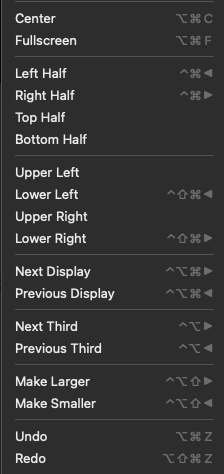

<!-- START doctoc generated TOC please keep comment here to allow auto update -->
<!-- DON'T EDIT THIS SECTION, INSTEAD RE-RUN doctoc TO UPDATE -->
**Table of Contents**  *generated with [DocToc](https://github.com/thlorenz/doctoc)*

- [Laptop Setup](#laptop-setup)
  - [Mouse \& Keyboard](#mouse--keyboard)
  - [Finder](#finder)
  - [Install Apps](#install-apps)
    - [Alfred](#alfred)
    - [Spectacle](#spectacle)
    - [Chrome](#chrome)
      - [Extensions](#extensions)
      - [Dev Tools](#dev-tools)
    - [Firefox Developer Edition](#firefox-developer-edition)
    - [SourceGear DiffMerge](#sourcegear-diffmerge)
    - [iTerm](#iterm)
      - [brew install](#brew-install)
    - [VS Code](#vs-code)
      - [Extensions](#extensions-1)
      - [Settings](#settings)
    - [Docker](#docker)
  - [Ruby](#ruby)

<!-- END doctoc generated TOC please keep comment here to allow auto update -->

# Laptop Setup

## Mouse & Keyboard

* Connect bluetooth magic mouse
* Connect bluetooth magic keyboard
* Prefs -> Keyboard: Use F1, F2 etc. as standard function keys
* Prefs -> Trackpad: Click to tap
* Prefs -> Mouse: Secondary click right side, disable smart zoom, turn off all gestures
* Prefs -> Dock: Small-ish, Magnification, small/medium, Minimize windows Genie effect, Auto hide/show

## Finder

* View -> Show Path Bar
* General -> New finder windows show {user}
* Sidebar -> Show {user}
* Advanced -> Show all filename extensions
* Show hidden files?
  * Terminal: `defaults write com.apple.finder AppleShowAllFiles YES`, then `killall Finder`

## Install Apps

### Alfred

* Prefs -> Appearance: Alfred Dark
* Prefs -> Web Bookmarks -> Google Chrome Bookmarks (prefix b)
* Prefs -> System -> Confirm

### Spectacle

Adjust shortcuts:



### Chrome

#### Extensions

* [uBlock Origin](https://chrome.google.com/webstore/detail/ublock-origin/cjpalhdlnbpafiamejdnhcphjbkeiagm)
* [Json viewer](https://chrome.google.com/webstore/detail/json-viewer/gbmdgpbipfallnflgajpaliibnhdgobh)
* Password manager?

#### Dev Tools

* console -> timestamps, preserve log on navigation
* network -> preserve log

### Firefox Developer Edition

### SourceGear DiffMerge

[Download](https://www.sourcegear.com/diffmerge/)

### iTerm

* Prefs -> Keys -> Hot Key: Cmd + Ctrl + t
* Prefs -> Appearance -> uncheck window tab title

```
xcode-select --install
```

[ohmyzsh](https://github.com/ohmyzsh/ohmyzsh)

[Powerline fonts](https://github.com/powerline/fonts)

[Agnoster + Solarized Dark](https://danielabaron.me/blog/how-i-setup-my-terminal/)

Copy `files/aliases.zsh` to `~/.oh-my-zsh/custom/aliases.zsh` (replace gdrive user if applicable)

[Homebrew](https://brew.sh/)

[nvm](https://github.com/nvm-sh/nvm) + [deeper shell integration](https://github.com/nvm-sh/nvm#zsh)

Add functions in `files/dot_zshrc` to `~/.zshrc`

#### brew install

* git
* tree
* bat
* tldr
* exa

Copy `files/dot_gitconfig` to `~/.gitconfig` (fill in actual user details)

Copy `files/dot_gitignore_global` to `~/.gitignore_global`

### VS Code

[FiraCode](https://github.com/tonsky/FiraCode)

#### Extensions

* Atom Keymap
* Bash Beautify
* Cucumber (Gherkin) Full Support
* Docker
* EditorConfig for VS Code
* ESLint
* GitLens - Git supercharged
* Markdown All in One
* Material Icon Theme
* Night Owl
* Path intellisense
* Peacock
* Prettify JSON
* Rainbow CSV
* REST Client
* Ruby
* Ruby Solargraph (maybe not yet)
* VSCode Ruby (is this needed in addition to Ruby?)
* vscode-gemfile
* YAML

#### Settings

Copy `files/vscode_settings.json` to `~/Library/Application Support/Code/User/settings.json` (replace `myuser` with actual user).

Copy `files/vscode_keybindings.json` to `~/Library/Application Support/Code/User/keybindings.json`

### Docker

[Apple silicon](https://docs.docker.com/desktop/install/mac-install/)

## Ruby

[rbenv](https://github.com/rbenv/rbenv)

```
brew install rbenv ruby-build
rbenv init
gem install bundler
```
