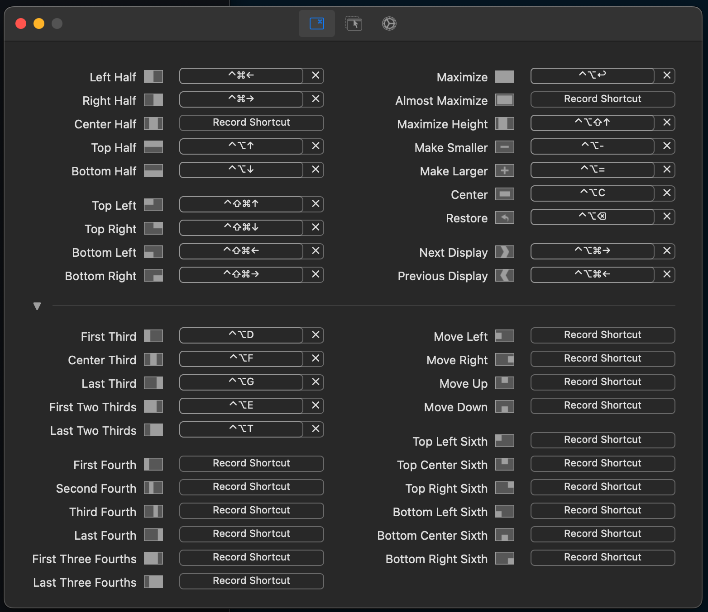

<!-- START doctoc generated TOC please keep comment here to allow auto update -->
<!-- DON'T EDIT THIS SECTION, INSTEAD RE-RUN doctoc TO UPDATE -->
**Table of Contents**  *generated with [DocToc](https://github.com/thlorenz/doctoc)*

- [Laptop Setup](#laptop-setup)
  - [Hardware](#hardware)
  - [Finder](#finder)
  - [Install Apps](#install-apps)
    - [Alfred](#alfred)
    - [Rectangle](#rectangle)
    - [Chrome](#chrome)
      - [Extensions](#extensions)
      - [Dev Tools](#dev-tools)
    - [Firefox Developer Edition](#firefox-developer-edition)
    - [iTerm](#iterm)
      - [brew install](#brew-install)
    - [VS Code](#vs-code)
      - [Settings](#settings)
    - [Docker](#docker)
  - [Ruby](#ruby)
  - [Password Manager](#password-manager)
  - [Github](#github)
  - [Printer](#printer)
  - [Data](#data)
  - [Other Apps](#other-apps)

<!-- END doctoc generated TOC please keep comment here to allow auto update -->

# Laptop Setup

## Hardware

* Connect bluetooth magic mouse
* Connect bluetooth magic keyboard
* Prefs -> Keyboard: Use F1, F2 etc. as standard function keys
* Prefs -> Trackpad: Click to tap
* Prefs -> Mouse: Secondary click right side, disable smart zoom, turn off all gestures
* Prefs -> Dock: Small-ish, Magnification, small/medium, Minimize windows Genie effect, Auto hide/show
* Connect external monitor
* Prefs -> Displays: Extend, arrange

## Finder

* View -> Show Path Bar
* General -> New finder windows show {user}
* Sidebar -> Show {user}
* Advanced -> Show all filename extensions
* Show hidden files?
  * Terminal: `defaults write com.apple.finder AppleShowAllFiles YES`, then `killall Finder`

## Install Apps

### Alfred

* Prefs -> Appearance: Alfred Dark
* Prefs -> Web Bookmarks -> Google Chrome Bookmarks (prefix b)
* Prefs -> System -> Confirm

### Rectangle

Adjust shortcuts:



### Chrome

* Sign in to Google account to sync bookmarks.
* Change [default search engine](https://support.google.com/chrome/answer/95426?hl=en&co=GENIE.Platform%3DDesktop)

#### Extensions

* [uBlock Origin](https://chrome.google.com/webstore/detail/ublock-origin/cjpalhdlnbpafiamejdnhcphjbkeiagm)
* [Json viewer](https://chrome.google.com/webstore/detail/json-viewer/gbmdgpbipfallnflgajpaliibnhdgobh)

#### Dev Tools

* console -> timestamps, preserve log on navigation
* network -> preserve log

### Firefox Developer Edition


### iTerm

[Install](https://iterm2.com/)

Install [Powerline fonts](https://github.com/powerline/fonts)

- copy `com.googlecode.iterm2.plist` from this repo to somewhere local
- iTerm Cmd + , to load Preferences pane
- General -> Preferences (sub-pane)
- Fill in checkbox "Load preferences from a custom folder or URL"
- Browse to path where saved the plist file (either specify the actual file or just the folder with a trailing slash!)
[ref](https://stackoverflow.com/questions/22943676/how-to-export-iterm2-profiles)
- Profiles: Load profile json from `files/dbaron.json`, make default (may have to quit and restart iTerm to see effect)

```
xcode-select --install
```

[ohmyzsh](https://github.com/ohmyzsh/ohmyzsh)

[Agnoster + Solarized Dark](https://danielabaron.me/blog/how-i-setup-my-terminal/)

Copy `files/aliases.zsh` to `~/.oh-my-zsh/custom/aliases.zsh` (replace gdrive user if applicable)

[Homebrew](https://brew.sh/)

[nvm](https://github.com/nvm-sh/nvm) + [deeper shell integration](https://github.com/nvm-sh/nvm#zsh)

Add functions in `files/dot_zshrc` to `~/.zshrc`

Make sure the following is in .zshrc:

```bash
```bash
ZSH_THEME="agnoster"

# Do not show username in prompt
DEFAULT_USER="dbaron"

# Oh My Zsh automatically sets the title of your terminal and tabs when running a command or printing the prompt.
# Use this setting if you want to disable that.
DISABLE_AUTO_TITLE=true
```

#### brew install

* git
* tree
* bat
* tldr
* exa
* postgresql@{latest_version}

Copy `files/.gitconfig` to `~/.gitconfig` (fill in actual user details)

Copy `files/dot_gitignore_global` to `~/.gitignore_global`

[Install heroku cli](https://devcenter.heroku.com/articles/heroku-cli)

### VS Code

[FiraCode](https://github.com/tonsky/FiraCode)

- Command Palette: Shell Command: Install 'code' command in PATH
- Run `./install_vscode_extensions.sh`

#### Settings

Copy `files/vscode_settings.json` to `~/Library/Application Support/Code/User/settings.json` (replace `myuser` with actual user).

Copy `files/vscode_keybindings.json` to `~/Library/Application Support/Code/User/keybindings.json`

### Docker

[Apple silicon](https://docs.docker.com/desktop/install/mac-install/)

## Ruby

[rbenv](https://github.com/rbenv/rbenv)

```
brew install rbenv ruby-build
rbenv init
gem install bundler
```

## Password Manager

- Install & authenticate to password manager
- Install corresponding browser extension

## Github

- Sign in
- [Setup ssh key](https://docs.github.com/en/authentication/connecting-to-github-with-ssh)
- [Install Github CLI](https://cli.github.com/)

## Printer

[Add printer](https://support.apple.com/en-ca/guide/mac-help/mh14004/13.0/mac/13.0#apd099ba26671c44)

## Data

- Copy files from old computer (backup drive?)
- Setup time machine backup

## Other Apps

- Figma
- Libre Office
- Dropbox
